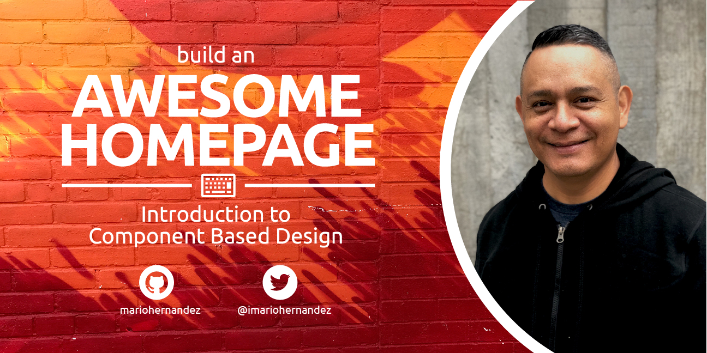

# Introduction to Component Based Web Design
A collection of resources and code base for people who completed the Skillshare class on Introduction to Component Based Web Design.

Class was provided by [Mario Hernandez](https://twitter.com/imariohernandez), Lead of Learning at Mediacurrent.



## Codebase
To download the entire codebase used in this class click the **Clone or Download** button above.

# Resources
* [Atomic Web Design](http://bradfrost.com/blog/post/atomic-web-design/)
* [Pattern Lab](https://patternlab.io/)
* [BEM 101](https://css-tricks.com/bem-101/)
* [Lorem Picsum](https://picsum.photos/)

## Download Gulp Configuration for Styles Compiling
If you wish to implement the Gulp configuration changes we discussed in the **Introduction to Pattern Lab** video, copy the following files and folders intro your project:

* gulp-tasks/
* patches/
* .gitignore
* .htaccess
* .nvmrc
* .sass-lint.yml
* .alter-twig.php
* gulpfile.js
* package.json
* patternlab-config.json

### Then follow these steps

1. Copy all the files above into the root of your Pattern Lab project
2. Delete **node_modules**
3. Delete **package-lock.json**

### Run the next commands from the root of your Pattern Lab project

```nvm use```

```npm install```

```npm run build```

```npm run watch```
